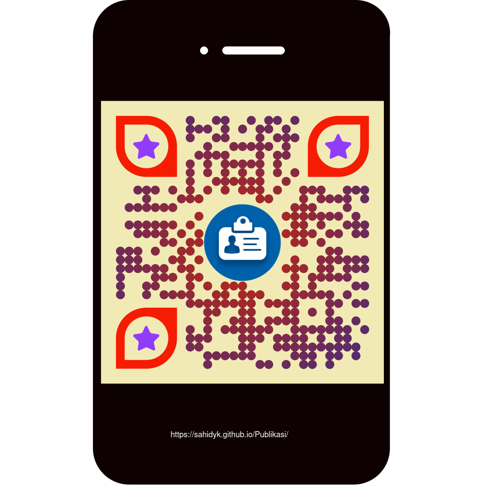

# Kumpulan Tulisan Sahid ([sahidyk@gmail.com](mailto:sahidyk@gmail.com), [sahid@uny.ac.id](mailto:sahid@uny.ac.id))
Berikut adalah kumpulan tulisan saya yang selama ini tercecer, saya coba kumpulkan dalam repositori ini. Beberapa judul merupakan bahan pelatihan di SEAMEO QITEP in MATHEMATICS yang saya tulis sewaktu saya diminta membantu di SEQIM. Beberapa tulisan juga merupakan permintaan dari teman di SEAMOLEC dan ICE. Semoga bermanfaat bagi para pembaca. Tulisan-tulisan ini saya saya hibahkan sebagai wakaf dan amal jariyah dan memberikan manfaat kelak di yaumul akhir. Aamiin. 
1. [Panduan Markdown](https://panduan-markdown.netlify.app/)
2. [Membuat Dokumen dan Catatan Ilmiah dengan Markdown](MarkdownTypora4ScientifDocs.pdf)
3. [Membuat Dokumen Matematika dengan Markdown](MembuatDokumenMatematikadenganMarkdown.pdf)
4. [Membuat Kelas dengan GeoGebra dan Mengintegrasikannya ke Google Classroom](Membuat Kelas dengan GeoGebra dan Mengintegrasikannya ke Google Classroom.pdf)
5. [Tutorial JavaScript](Tutorial JavaScript.html)
6. [JavaScript untuk Perhitungan Aritmetika](JavaScript4Arithmetic.html)
7. [Menggambar Grafik dengan JavaScript](JS4Grafik.html)
8. [Pemrograman dengan Bahasa LOGO](PemrogramanLOGO.pdf)
10. [Pendekatan Baru Pembelajaran Persamaan Garis Lurus](Pendekatan Baru Pembelajaran Persamaan Garis Lurus.pdf)
11. [Panduan Pengembangan Konten Digital](Panduan Pengembangan Konten Digital.pdf)
12. [Using Mathematics Problem Solving to Support Joyful Learning in Mathematics Teaching and Leanring](UsingMathematicsProblemSolvingtoImproveStudentMathematicalThinkinginLearningMathematics.pdf)
13. [Developing Instructional Media for Primary School Mathematics Teaching and Learning](Developing Instructional Media for Primry Schol Mathematics Teaching and Learning.pdf)
14. [Using ICT to Support Joyful Learning in Mathematics Teaching and Learning at Junior Secondary School](Using ICT to Support JL.pdf)
15. [Using ICT to Support RME-Based Mathematics Teaching and Learning at Junior Secondary School](Using ICT to Support RME.pdf)
16. [Aplikasi Komputer untuk Matematika dengan Euler Math Toolbox (EMT)](CetakAplikom.pdf)
17. [Matematika itu Mengasyikkan dan Menyenangkan](Matematika itu Menyenangkan dan Mengasyikkan.pdf)
18. [Learnig Management System (LMS): Tulisan lama, 2006](LMS4SEAMOLEC.pdf)
19. [Antara Teorema Pythagoras dan Trigonometri: Saling Tergantung atau Bebas?](Teorema_Pythagoras_vs_Trigonometri_Saling_Tergantung_atau_Bebas.pdf)

**Pada hari ini Anda adalah pengunjung halaman ini yang ke:** 

